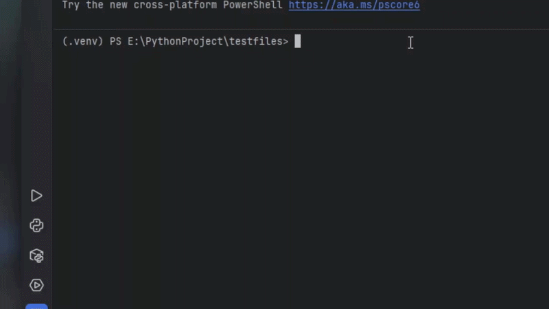
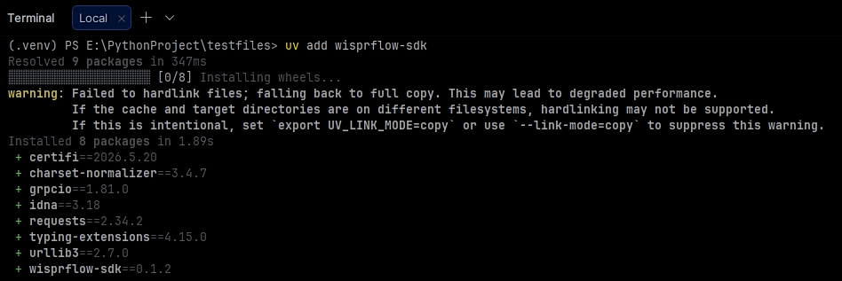
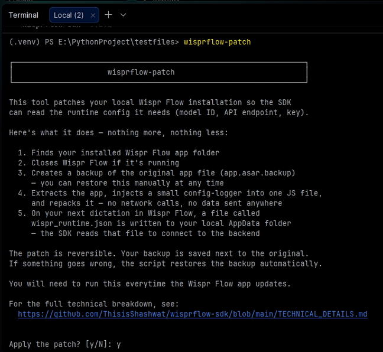
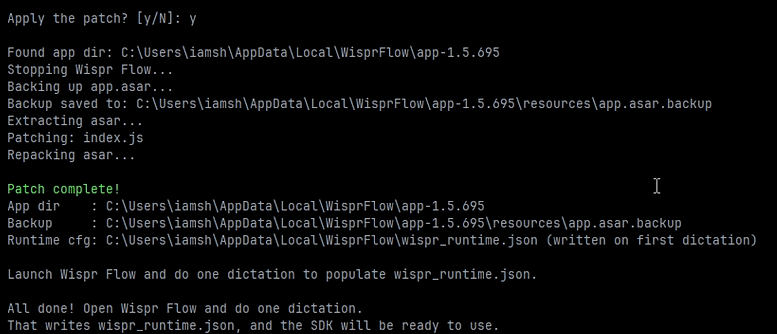
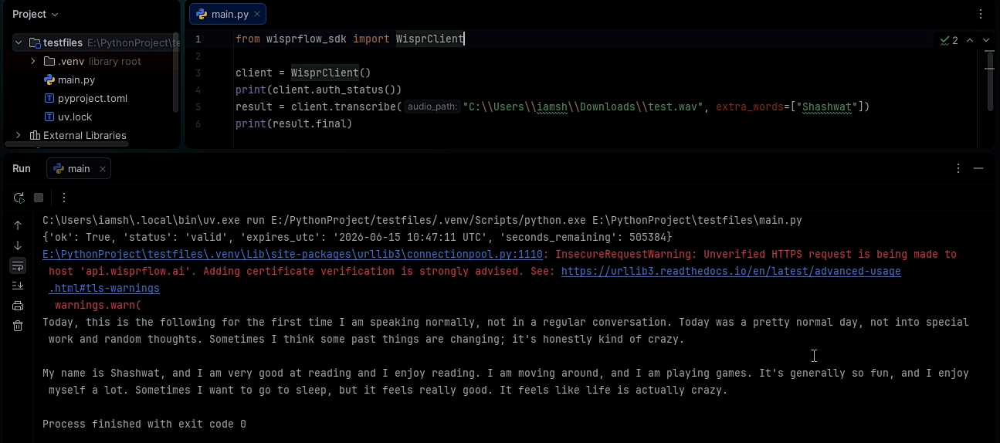
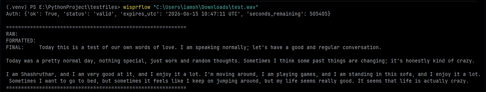

# Visual Guide

This page provides a visual walkthrough of the SDK setup and usage.

> [!IMPORTANT]
> You must have Wispr Flow installed and logged in on your system to make it work. Even a free account will work, but that is not necessary. So go and grab the installation from wisprflow.ai's website 
>
> This script is literally useless without Wisprflow installed.

## Demo

The animated demo below shows the SDK running:

---

## Installation

Follow the installation instructions in `README.md`.

### Install the package

### Run the patch

## Running the SDK

Example output from a transcription:

Example CLI usage:

---

## More Information

* See `README.md` for complete setup instructions.
* See `DOCS.md` for API documentation.
* See `TECHNICAL_DETAILS.md` for implementation details.
* See `wisprflow_example.py` for annotated examples.
